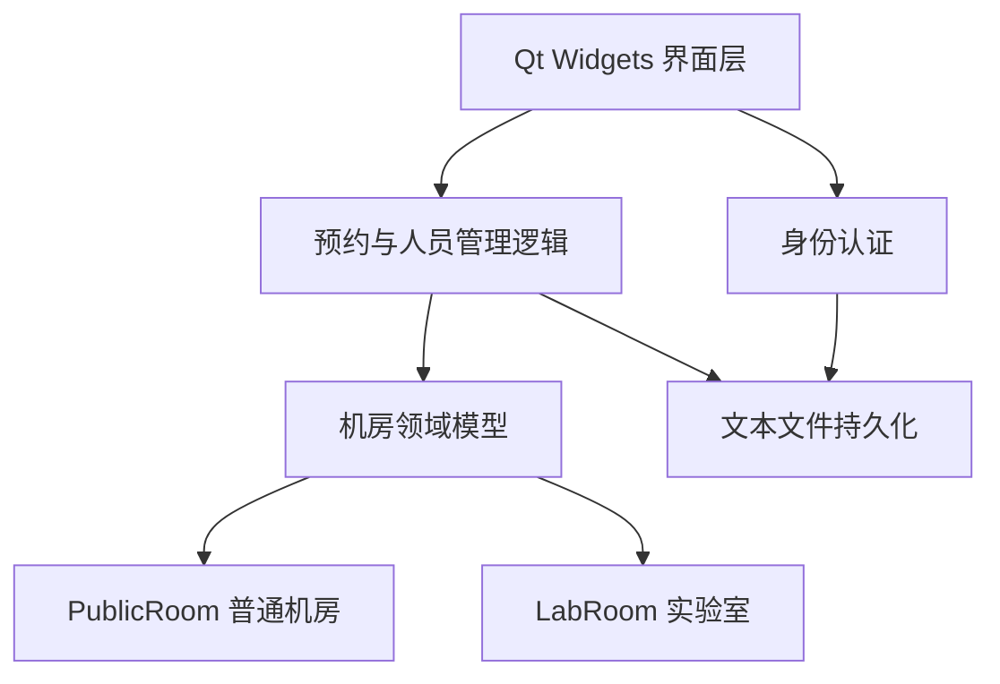

# SRSYS — 机房预约管理系统

> 一个基于 **C++17 + Qt Widgets** 开发的桌面端机房预约管理系统，面向学生、教师和管理员三类用户，覆盖账号登录、机房预约、预约审核、记录查询与人员管理等基础业务流程。

## 项目概览

SRSYS（School Room Reservation System）是一个 Qt 桌面应用。项目采用 `.ui` 文件构建界面，以 C++ 类实现业务逻辑，并使用本地文本文件保存账号、机房和预约数据。

项目重点展示：

- Qt Widgets 多窗口应用开发
- 信号与槽机制
- C++ 继承、多态和抽象接口
- 本地文本数据的解析与持久化
- 学生预约、教师审核、管理员维护的多角色业务流程
- 普通机房与实验室不同座位规则的建模

## 功能特性

### 学生端

- 使用姓名、学号和密码登录
- 查看可预约的日期、时间段和机房
- 提交机房预约
- 查看个人预约记录及状态
- 取消审核中或已通过的预约
- 实验室支持选择一人或两人使用同一台机器

### 教师端

- 使用姓名、工号和密码登录
- 查看全部预约记录
- 查看待审核预约
- 通过或驳回学生预约申请

### 管理员端

- 使用管理员账号登录
- 新增学生或教师账号
- 按姓名或 ID 查询人员
- 导出指定学生的预约记录
- 清空当前预约数据

### 机房规则

| 机房 | 类型 | 默认规则 |
| --- | --- | --- |
| 1～3 号 | 普通机房 | 一人一机 |
| 4～5 号 | 实验室 | 每台机器最多容纳两人，支持拼机 |

机房数量和机器数从 `computerRoom.txt` 读取。仓库示例数据包含 5 个机房。

## 预约流程


当前预约状态约定如下：

| 状态值 | 含义 |
| --- | --- |
| `1` | 审核中 |
| `2` | 预约成功 |
| `0` | 审核失败 |
| `-1` | 已取消 |

## 技术栈

| 类别 | 技术 |
| --- | --- |
| 编程语言 | C++17 |
| GUI 框架 | Qt Widgets |
| 项目构建 | qmake / `.pro` |
| 界面设计 | Qt Designer `.ui` 文件 |
| 数据存储 | 本地文本文件 |
| 主要 Qt 类型 | `QMainWindow`、`QDialog`、`QFile`、`QTextStream`、`QVector`、`QMap` |

## 系统设计



### 主要模块

- `identity`：学生、教师和管理员的身份基类。
- `student` / `teacher` / `manager`：三类用户模型。
- `ComputerRoom`：机房抽象基类，定义剩余座位、预约和取消操作。
- `PublicRoom`：普通机房实现，一台机器对应一名学生。
- `LabRoom`：实验室实现，支持一人使用或两人拼机。
- `orderFile`：预约文件解析和更新。
- `loginInFile`：基于账号文件完成身份认证。
- `PersonFinder`：人员查询抽象接口。
- `FindByID` / `FindByName`：按 ID 或姓名查询人员的多态实现。

## 环境要求

- Windows 10/11
- Qt 5 或 Qt 6（需要 Qt Widgets 模块）
- 支持 C++17 的编译器
  - MinGW，或
  - MSVC
- Qt Creator（推荐）

> 项目当前使用 Windows 绝对路径保存数据，因此不建议直接在 Linux 或 macOS 上运行。跨平台支持需要先改造文件路径。

## 快速开始

### 1. 克隆仓库

当前数据路径在 `globalfile.h` 中固定为 `D:/system/SRSYS`。若希望不修改源代码直接运行，请克隆到对应目录：

```powershell
New-Item -ItemType Directory -Force D:\system
Set-Location D:\system
git clone https://github.com/HSEZCZYW/SRSYS.git
Set-Location .\SRSYS
```

如果项目位于其他目录，请先修改 `globalfile.h` 中的路径：

```cpp
#define ADMIN_FILE    "D:/system/SRSYS/admin.txt"
#define STUDENT_FILE  "D:/system/SRSYS/student.txt"
#define TEACHER_FILE  "D:/system/SRSYS/teacher.txt"
#define COMPUTER_FILE "D:/system/SRSYS/computerRoom.txt"
#define ORDER_FILE    "D:/system/SRSYS/order.txt"
#define ORDER_READ    "D:/system/SRSYS/order_readonly.txt"
```

`main.cpp` 和人员查询模块中还有少量相同的绝对路径。迁移目录时，应同步搜索并替换：

```powershell
rg "D:/system/SRSYS|D:\\system\\SRSYS"
```

### 2. 使用 Qt Creator 构建

1. 启动 Qt Creator。
2. 选择 **File → Open File or Project**。
3. 打开 `SRSYS.pro`。
4. 选择可用的 Desktop Kit（MinGW 或 MSVC）。
5. 点击 **Configure Project**。
6. 执行 **Build**，然后点击 **Run**。

### 3. 使用命令行构建

MinGW 示例：

```powershell
qmake SRSYS.pro
mingw32-make -j4
```

MSVC 示例：

```powershell
qmake SRSYS.pro
nmake
```

具体命令取决于 Qt Kit。运行命令前，请确保 Qt 和编译器目录已加入 `PATH`。

## 数据文件

项目根目录中的文本文件既是示例数据，也是程序运行时的数据源。

| 文件 | 用途 | 数据格式 |
| --- | --- | --- |
| `admin.txt` | 管理员账号 | `用户名 密码` |
| `student.txt` | 学生账号 | `姓名 学号 密码` |
| `teacher.txt` | 教师账号 | `姓名 工号 密码` |
| `computerRoom.txt` | 机房容量 | `机房编号 机器数量` |
| `order.txt` | 当前预约数据 | 空格分隔的 `key:value` 字段 |
| `order_readonly.txt` | 预约历史展示数据 | 与 `order.txt` 类似 |

预约记录示例：

```text
date:4 interval:1 studentID:123 studentName:example roomID:4 seat:1 status:1
```

两人使用实验室机器时，记录末尾会增加：

```text
|persons:2
```

字段说明：

| 字段 | 说明 |
| --- | --- |
| `date` | 星期编号 |
| `interval` | 时间段编号 |
| `studentID` | 学号 |
| `studentName` | 学生姓名 |
| `roomID` | 机房编号 |
| `seat` | 机器编号 |
| `status` | 预约状态 |
| `persons` | 使用该机器的人数，缺省为 1 |

管理员导出的学生预约报告会保存到：

```text
D:/system/SRSYS/research_order_record/
```

## 项目结构

```text
SRSYS/
├── SRSYS.pro                         # qmake 项目配置
├── main.cpp                          # 程序入口与机房初始化
├── mainwindow.{h,cpp,ui}             # 身份选择主窗口
├── globalfile.h                      # 数据文件路径配置
├── identity.h                        # 身份抽象基类
├── student.{h,cpp}                   # 学生模型
├── teacher.{h,cpp}                   # 教师模型
├── manager.{h,cpp}                   # 管理员模型
├── computerRoom.h                    # 机房抽象基类
├── publicroom.{h,cpp}                # 普通机房规则
├── labroom.{h,cpp}                   # 实验室与拼机规则
├── orderFile.{h,cpp}                 # 预约文件读写
├── logininfile.{h,cpp}               # 登录验证
├── personfinder.{h,cpp}              # 人员查询接口
├── findbyid.{h,cpp}                  # 按 ID 查询
├── findbyname.{h,cpp}                # 按姓名查询
├── student_*                         # 学生端窗口
├── teacher_*                         # 教师端窗口
├── manager_*                         # 管理员端窗口
└── *.txt                             # 示例账号、机房与预约数据
```

## 核心设计亮点

### 1. 面向对象的机房模型

`ComputerRoom` 定义统一接口，`PublicRoom` 和 `LabRoom` 分别实现不同容量与座位分配规则。界面层可以通过基类指针使用不同类型的机房。

### 2. 策略式人员查询

`PersonFinder` 提供统一的查询接口，`FindByID` 和 `FindByName` 封装不同查询策略，便于继续扩展其他查询方式。

### 3. 角色隔离

学生、教师和管理员分别拥有独立登录窗口与功能窗口，使不同角色的操作入口保持清晰。

### 4. 可读的文本数据

预约采用 `key:value` 形式保存，便于在开发和调试阶段直接查看数据变化。

## 已知限制

该项目目前更适合作为课程设计和 Qt/C++ 学习项目。用于真实环境前，建议优先处理以下问题：

- 数据路径硬编码为 `D:/system/SRSYS`，缺少跨平台路径管理。
- 账号与密码以明文保存在文本文件中，不适合生产环境。
- 文本文件没有事务、文件锁和并发访问保护。
- `order.txt` 与 `order_readonly.txt` 分别维护，部分操作可能造成状态不同步。
- 示例账号和预约数据会随仓库一起分发，请勿放入真实个人信息。
- 当前没有自动化测试、持续集成或正式发布包。
- 部分文件和类名存在大小写或拼写不一致，在区分大小写的平台上可能导致构建失败。

## 建议演进方向

- 使用 `QStandardPaths` 和 `QDir` 管理应用数据目录。
- 将文本文件替换为 SQLite，并增加事务与数据约束。
- 使用密码哈希保存凭据，避免明文密码。
- 抽离 Repository / Service 层，降低界面与持久化代码的耦合。
- 统一命名规范并修正文件名大小写。
- 为预约、取消、审核和机位分配逻辑增加单元测试。
- 增加 CMake 构建配置和 GitHub Actions。
- 增加截图、发行包和版本变更记录。

## 常见问题

### 登录时始终提示信息错误

确认：

1. 程序能访问 `globalfile.h` 指定的数据文件。
2. 输入字段与文本文件中的姓名、ID 和密码完全一致。
3. 文件使用空格分隔字段，且每条账号占一行。

### 启动后提示无法打开 `computerRoom.txt`

项目不在 `D:/system/SRSYS` 时，需要修改 `globalfile.h` 和其他硬编码路径，然后重新构建。

### 编译器找不到 Qt Widgets

确认选择的是 Desktop Qt Kit，并且 Qt 安装中包含 Widgets 模块以及对应的 MinGW/MSVC 编译器。

### 在 Linux 上出现头文件找不到

Windows 文件系统通常不区分大小写，而 Linux 区分。需要统一源文件中的 include 名称与实际文件名，例如 `ComputerRoom.h` 与 `computerRoom.h`。

## 贡献

欢迎通过 Issue 提交问题或建议，也欢迎通过 Pull Request 改进代码、文档和测试。提交前建议：

1. 确认项目能够在 Qt Creator 中正常构建。
2. 不提交真实账号、密码或个人信息。
3. 说明修改目的、影响范围和验证方式。

## License

仓库当前未提供开源许可证。在许可证补充之前，默认保留所有权利；如需使用、分发或修改，请先联系项目维护者。
